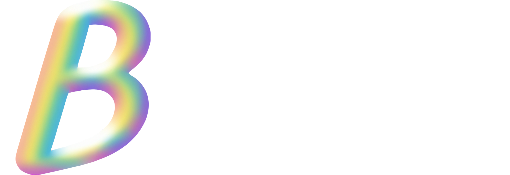

# BBNF lang

_Better Backus-Naur Form_

---

An extension to EBNF that allows for the definition of context-free grammars. Used
within the [`parse-that`](https://github.com/mkbabb/parse-that) parser generator. Herein
is the VS Code language support for BBNF.

## Features

-   Syntax highlighting 🌈
-   Code formatting 🎨
-   Intellisense 🧠
-   Folding regions 📦
-   Error squiggles for various malformations 🚫
-   Left-recursion detection & elimination ⚙️
-   Topological rule sorting 📐
-   _SOON_ - Grammar transformation 🧪
    -   Converting to EBNF, ABNF, etc.

### Intellisense, syntax highlighting & error reporting

### Code formatting

Powered by [`prettier`](https://prettier.io/) and
[`prettier-plugin-bbnf`](./src/prettier-plugin-bbnf/index.ts). Takes this:

And converts it to this:

### Left-recursion detection & elimination; Topological rule sorting

If chosen, the extension will automatically detect and eliminate left-recursion in your
grammar. It will also sort your rules topologically, so that rules that depend on other
rules are defined after the rules they depend on. This is useful for the parser
generator, which will generate a parser that is more efficient if the rules are defined
in this order.

## About

Sort of a real-world example of a modern VS Code extension using the newly formulated
LSP (Language Server Protocol) and the new VS Code API. That notwithstanding, this is
still fairly useful for anyone looking to write a grammar using a BNF-like syntax.

Created because I was tired of writing grammar files with the fairly cumbersome EBNF
syntax. And moreover had no way of validating, formatting, or otherwise working with my
grammar files. VS code's got me spoiled 😭.
